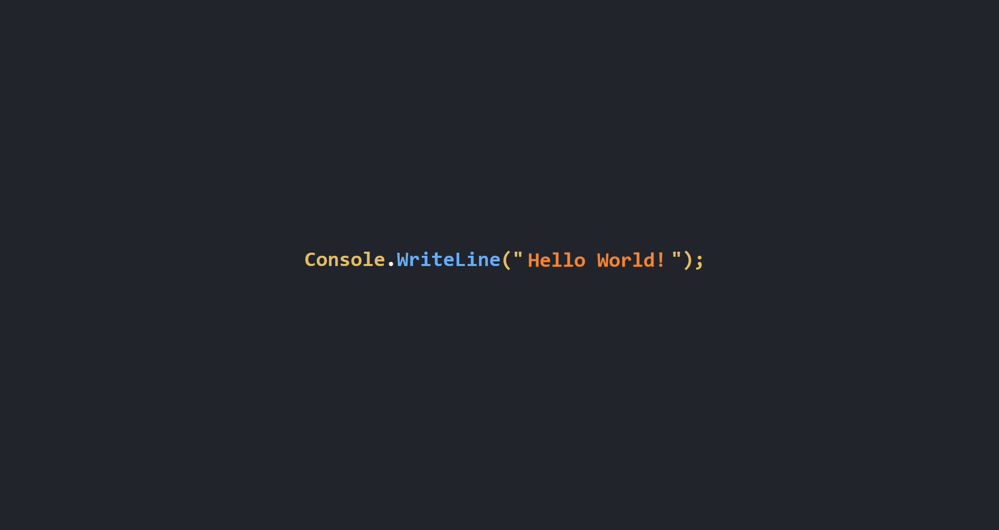

# Website 3.0
<!--A simple catchy description-->
Simple portfoliio website version 3.0 (active)!
## About
<!--An image to show your project-->

### Description
<!--In depth description, add more subtitles as necessary-->
This is a simple portfolio website build to display my projects. This is version 3.0, you may view the updated version [here](https://austinkong.github.io/Website/)
### Technology
<!--The tech stack used, with simple descriptions of what each thing does-->
* HTML: Structure of the website
* CSS: Styling the website
* JavsScript: Frontend logic
## Getting Started
### Deployment
<!--Download instructions for users for the program, not developers-->
Download instructions for users:
1. Clone the repository
2. Open index.html
### Installation
<!--Installation and setup instructions for developers-->
Installation and setup instructions for developers:
1. Fork and clone the repository
2. Start coding and build something awesome!
### Contributing
<!--Talk about state of project. Instructions to forking and developing.-->
This project is does not accept contributions, and is not under active development!
## Help
## Authors
<!--List of authors with links to their GitHub-->
Austin Kong [@AustinKong](https://github.com/AustinKong)
## License
<!--Simple description of license, linked to license.txt file-->
This project is licensed under MIT license. View license in [license.txt](license.txt)
